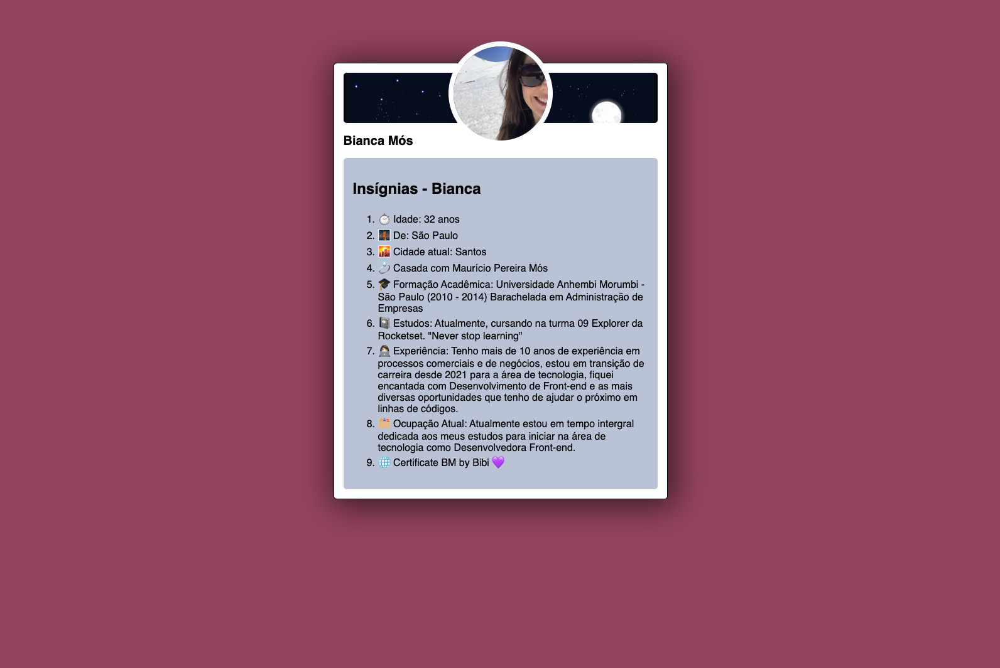
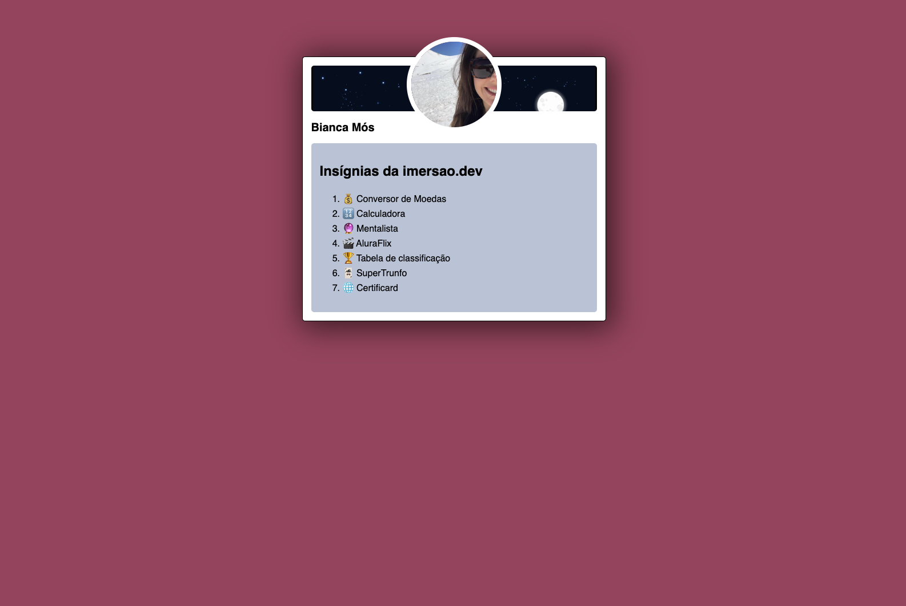
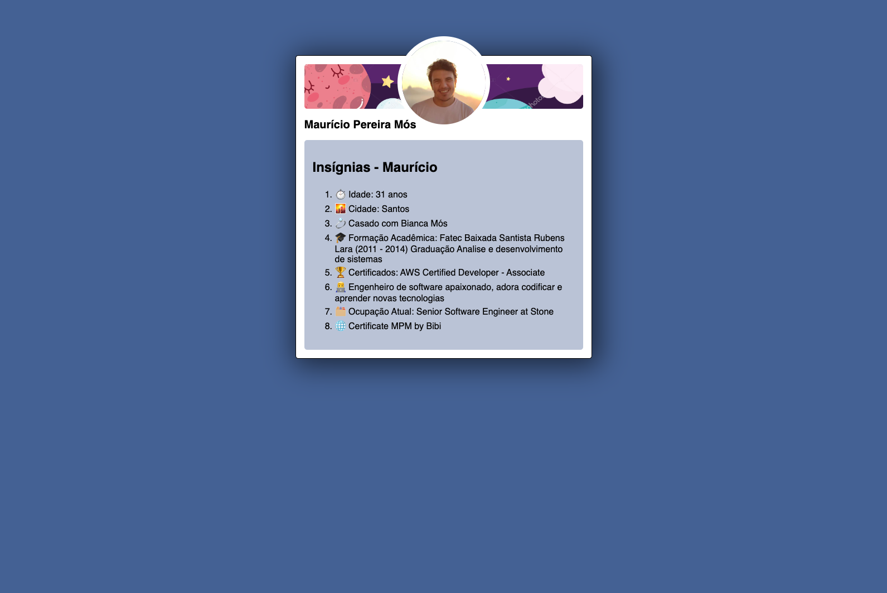
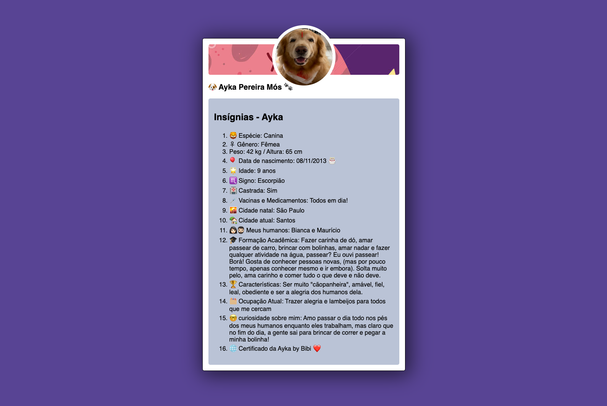

# 🖼 Cartão de apresentação
### 🧑🏻‍🎨🎨🖌 Presentation card
 

📸 Screenshot

#  🚀 Technologies

- [HTML](../index.html)
- [CSS](../style.css)
- [JavaScript](../script.js)
- [Github](##github)
- [Codepen](https://codepen.io/biancamos/full/KKampbG)
- [VScode](##vscode)

# 👩🏻‍💻 Project
Project made in immersion dev_ Alura's course of development for beginner

🪄✨

PT-BR: Projeto feito em curso imersão dev_ curso de desenvolvimento para iniciante da Alura 

📸 Screenshot

 #
 
                        Feito com 💜 by BM

 #### 🔎 **[Online project here](https://codepen.io/biancamos/full/KKampbG)** First project developed in September 2022, second project developed in February 2023
 🪄✨
 
 #### PT-BR: 🔎 **[Online project here](https://codepen.io/biancamos/full/KKampbG)** Primeiro projeto desenvolvido em Setembro de 2022, segundo projeto desenvolvido em Fevereiro de 2023.